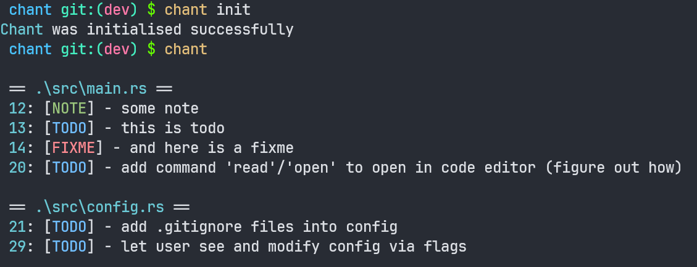

# chant

## About
Chant is a little cli tool to work with comments and generate documentation

## Usage

### Example



### Commands

Main commands:
- `chant init` to initialize chant. It creates `.chant/` directory and adds it to the `.gitignore` file
- `chant` or `chant list` - display all found comments
- `chant scan` - forced scan without hash checking
- `chant config` - display current config
- `chant dismiss` - removes `.chant/` dir and removes it from `.gitignore` file

You can also run Chant without initializatoin with `chant --hollow` command. This will not create `.chant/` directory, so not all functions will be available

You can run `--help` with any command for more informaton

### About

#### General usage

v0.3.0 turns Chant into an autodoc tool!
You can add this kind of comments, and they will be saved in storage
```rs
/// About foo()
/// foo bar baz
pub fn foo() {
    ...
}
```

Those comments can be saved to a files (one file per folder) with `chant about -s [<filename>]` command.
If you don't provide any filename, chant will create `about.md` files by default.
When you provide a new filename, it will be saved in config and used later automatically
You can find examples of those files in this repo:
 - [src/commands/about.md](src/commands/about.md)
 - [src/services/about.md](src/services/about.md)
 - [src/about.md](src/about.md)

#### Linking

You can declare and object be playcing it in between of `|` symbol, and reference it with later
Example:
1. code:
```rs
/// About |foo()|
/// Does something cool
fn foo() {}

/// About |bar()|
/// calles [foo()] to do something even better
fn bar(){
    let f = foo()
    // ...
}
```

2. result:
```markdown
...
#### *About* [foo()](file.rs#L1)
Does something cool

#### *About* [bar()](file.rs#L5)
calles [foo()](file.rs#L1) to do something even better
...
```

Real example you can find here:
- [COMMENT_PATTERN](src/about.md#L15)
- [ABOUT_COMMENT](src/about.md#L16)


### Task

Tasks were appeared in v0.2.0. Essentially, it's a simple 'todo' app inside Chant
- `chant task` - list of tasks
- `chant task add/new <message>` - add new task with message
- `chant task edit <id>` - change task message
- `chant task done <id>` - mark task as complete
- `chant task remove <id>` remove one task from storage

### Config

Now in `.chant/config.toml` chant stores 2 blocks:
1. `[scanner]`:
    1. list of supported files (extentions)
    2. list of ignored directories
2. `[about]`
    1. name of the files with 'about' blocks

You can modify both of this, but be careful, chant **doesn't** supports languages, where comments are not started with `//`. I'll add this later

### Useful flags
- `chant` with `-t --todo`, `-n --note`, `-f --fixme` - show specific comments (works with `--hollow` flag) 
- `chant [list]` with `-b --both` - show both comments and tasks
- `chant remove --done` - remove every complete task
- `chant remove --all` - remove all tasks

## Installation

```bash
git clone https://github.com/EnotInc/chant.git
cd chant
cargo install --path .
```
